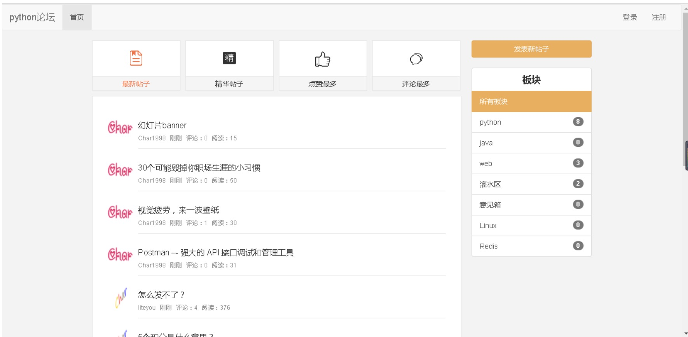
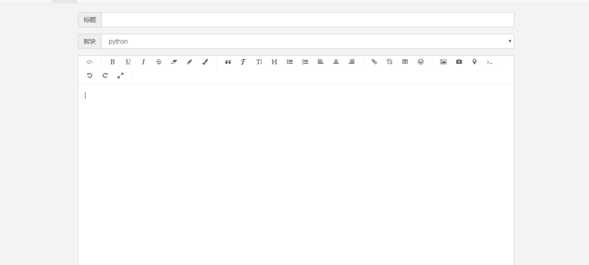
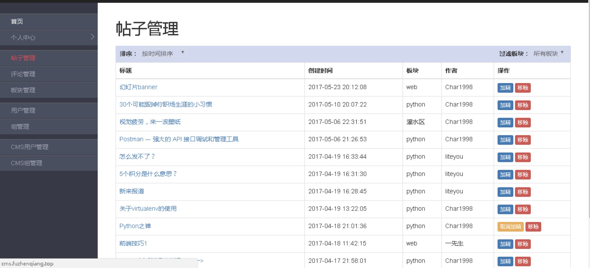

## 功能点

### 前台
1. 登录注册，不需要短信和邮箱验证
2. 发帖
3. 评论帖子
4. 回复评论
5. 首页，可以对帖子进行过滤和按时间、按评论量和按加精的方式进行排序。

### 后台
1. 用户系统，权限和分组。可以把某个用户分给某个权限，也可以把某个组分给某个权限。
2. 管理帖子，功能：加精，删除等。
3. 管理板块，功能：增删改查等。
4. 评论，功能：增删改查等。
5. 前台用户，功能：增删改查等。
6. CMS用户，功能：增删改查等。

上面是列的基本功能点，其他可以随意发挥。

### 注意点
* 前后端要分离
* 样式没要求

## 示意图
### 首页

### 发帖

### 后台
